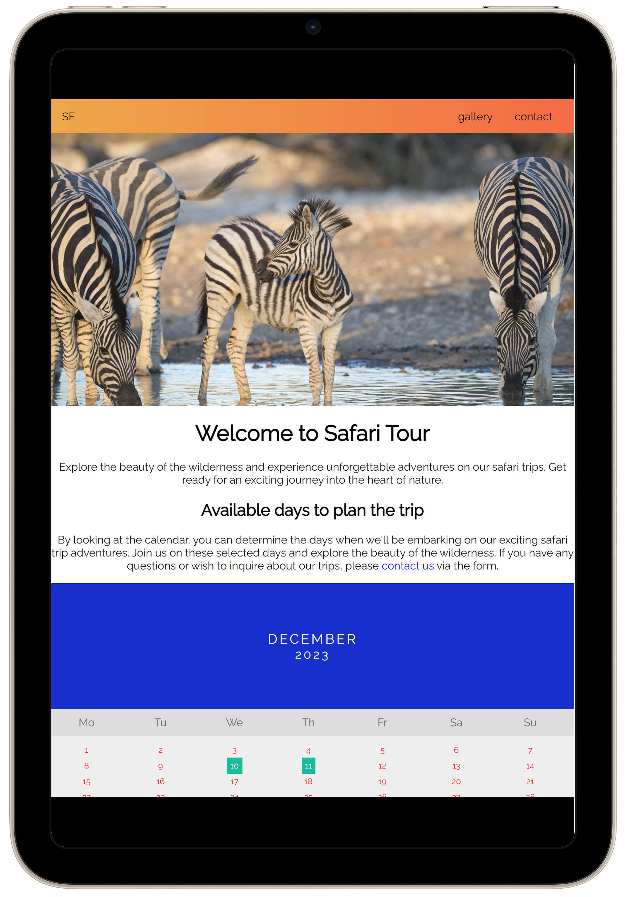
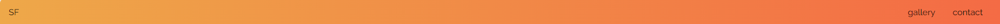
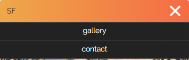
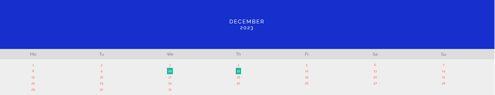
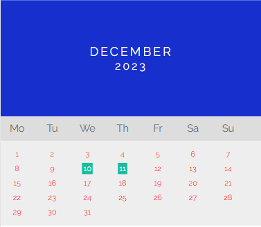
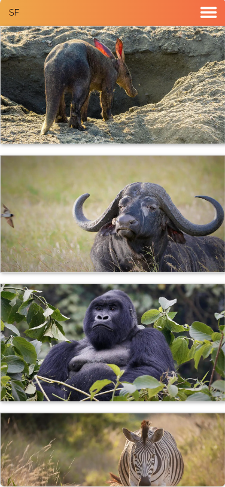

# Safari Tour

Welcome to the Safari Tour Website, your passport to a world of adventure and natural wonders. Our project, the Safari Tour Website, is your gateway to the ultimate exploration of the wild.

## Features

- Navigation Bar
  - Featured on all three pages, the full responsive navigation bar includes links to the Logo, Home page, Gallery and Contact page and is identical in each page to allow for easy navigation.
  - This section will allow the user to easily navigate from page to page across all devices without having to revert back to the previous page via the ‘back’ button.
    
    
    
- Calender
  - The calender section will allow the user to see the days of the planned trips.
    
    
- The footer
  - The footer section includes links to the relevant social media sites for Love Running. The links will open to a new tab to allow easy navigation for the user.
  - The footer is valuable to the user as it encourages them to keep connected via social media
    
- Gallery
  - The gallery will provide the user with diffrent images of wildlife animals.
    
- Contact
  - The Contact Page will provide the ability for the user to contact and book a trip
    

## Testing

- Validator Testing
  - HTML
    - No errors were returned when passing through [validator.w3.org](https://validator.w3.org/)
  - CSS
    - No errors were returned when passing through [(Jigsaw) validator](https://jigsaw.w3.org/css-validator/#validate_by_input)

## Deployment

## Credits

- Content
  - The icons in the footer were taken from [Font Awesome](https://fontawesome.com/)
- Media
  - The images used for the gallery page were taken from [AFRICAN WILDLIFE FOUNDATION](https://www.awf.org/wildlife-conservation/all)
