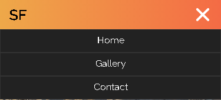
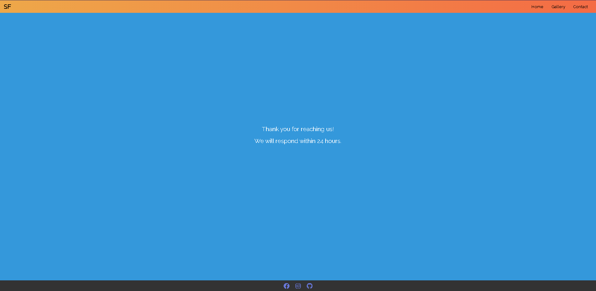

# Safari Tour

The Safari Tour website allows people to learn about the wild life and find information about animals living in the wild . The visitors of the website could quickly contact the company about booking a trip as well as asking questions.
The site can be accessed by this [link](https://khaled-alasadi.github.io/Safari-Tour/)
    

---

## User Stories

### First Time Visitor Goals:

- As a First Time Visitor, I want to easily understand the main purpose of the site, so I can learn more about the wildlife.
- As a First Time Visitor, I want to be able to easily navigate through the website, so I can find the content.

### Returning VisitorGoals:

- As a Returning Visitor, I want to see diffrent documentaries, so that I can learn more about wildlife animals.
- As a Returning Visitor, I want to see information about animals, so that I can learn about each animal.
- As a Returning Visitor, I want to find a way to get in contact with the organization, so that I can ask additional questions or book a trip.
- As a Returning Visitor, I want to find community links, so that I can learn more about the organization.

### Frequent Visitor Goals:

- As a Frequent User, I want to have options for the reason to contact the company, so I can get an explicit answer to my email.
- As a Frequent User, I want to learn about various animals, so I can widen my horizons.

## Features

- ### Navbar

- ##### Navigation

  - Positioned at the top of the page.
  - Contains logo of the company on the left side.
  - Contains navigation links on the right side:
    - HOME - leads to the home page where users can learn about the company Safari Tour.
    - GALLERY - leads to the gallery page where users can see various animals that lives in the wild.
    - CONTACT - leads to the contact form page where users can fill out the form in order to get in touch with the company.
  - The links have animated hover effect.
  - The navigation is clear and easy to understand for the user.
    

  - The navigation bar is responsive:

    - On mobile devices:

      - navigation bar filled with the logo in the center and a hamburger menu implemented on the right side of the navigation bar.  
        

      - When the hamburger menu is clicked, there is dropdown menu with the links in the same order.
        

---

- ### Home Page

  - Represent:

    - the main idea of the company.
    - Emphasize the strong points of the company.
    - Shows calender for available trips.
    - Shows documentaries videos that the users can watch.

  

---

- #### Videos Section

  - Videos section have six diffrent documentaries.
    

---

- #### Call to Action Section

    - Call to Action Section has an explicit message for the visitors of the website to contact the company.

    - has also a button that directs to the contact page.

---

- #### Footer

  - Footer contains social media links that open in a new tab.
    

---​

- ### Gallery Page

  - It has photos of some animals that lives in the wild.
    - The gallery is responsive: the size of the photo depends on the user's screen.
    - description information contains the name of the animal and its characteristics.
  - It has a call to action section below the gallery with the incentivizing message and the button that leads to the contact form.

  - It has a footer identical to the home page's footer.

  

---

- ### Contact page

  - Contact page has a contact form:
    - All text input fields are customized.
    - All inputs are set to be required to fill out except for Last Name.
    - It has dropdown for the visitors to choose the country.
    - The submit button is animated on hover.
  - The page is responsive on all common screen sizes.
  - The submit button leads to the response page.

  

---

- ### Response page

  - Response page appears after submitting the contact form.
  - It contains the thank you message and the promise to get in touch with the applicant within 24 hours.
    

---

## Technologies Used

- [HTML](https://developer.mozilla.org/en-US/docs/Web/HTML) was used as the foundation of the site.
- [CSS](https://developer.mozilla.org/en-US/docs/Web/css) - was used to add the styles and layout of the site.
- [CSS Flexbox](https://developer.mozilla.org/en-US/docs/Learn/CSS/CSS_layout/Flexbox) - was used to arrange items simmetrically on the pages.
- [Balsamiq](https://balsamiq.com/) was used to make wireframes for the website.
- [VSCode](https://code.visualstudio.com/) was used as the main tool to write and edit code.
- [GitHub](https://github.com/) was used to host the code of the website.

---

## Design

### Color Scheme

- blue color was used for the "contact us" button and the calender .

- Orange color was used for the header and the hover effect for the footer icons and the contact us button.

- Grey and/or white colors was used for the background.

### Typography

- Raleway Google Font was used as the main font of the website.

### Wireframes

#### Mobile devices

- [Home Page. Mobile Screen](documentation/mobile_home_page.png)
- [Home Page 2. Mobile Screen](documentation/mobile_home_page2.png)
- [Gallery Page. Mobile Screen](documentation/mobile_gallery_page.png)
- [Contact Page. Mobile Screen](documentation/mobile_contact_form_page.png)
- [Response Page. Mobile Screen](documentation/mobile_response_page.png)

#### Tablets

- [Home Page. Tablet Screen](documentation/tablet_home_page.png)
- [Home Page 2. Tablet Screen](documentation/tablet_home_page2.png)
- [Gallery Page. Tablet Screen](documentation/tablet_gallery_page.png)
- [Contact Page. Tablet Screen](documentation/tablet_contact_form_page.png)
- [Response Page. Tablet Screen](documentation/tablet_response_page.png)

#### Desktop

- [Home Page. Desktop Screen](documentation/desktop_home_page.png)
- [Gallery Page. Desktop Screen](documentation/desktop_gallery_page.png)
- [Contact Page. Desktop Screen](documentation/desktop_contact_form_page.png)
- [Response Page. Desktop Screen](documentation/desktop_response_page.png)

---

## Testing

Please refer to the [TESTING.md](TESTING.md) file for all test-related documentation.

---

## Deployment

### Deployment to GitHub Pages

- The site was deployed to GitHub pages. The steps to deploy are as follows:
  - In the [GitHub repository](https://github.com/Khaled-AlAsadi/Safari-Tour), navigate to the Settings tab
  - From the source section drop-down menu, select the **Main** Branch, then click "Save".
  - The page will be automatically refreshed with a detailed ribbon display to indicate the successful deployment.

The live link can be found [here](https://khaled-alasadi.github.io/Safari-Tour/)

### Local Deployment

In order to make a local copy of this project, you can clone it.
In your IDE Terminal, type the following command to clone my repository:

- `git clone https://github.com/Khaled-AlAsadi/Safari-Tour.git`

---

## Future improvements

- add favicon with [Favicon Generator.](https://realfavicongenerator.net/);
- add custom 404 page;
- improve the quality of the commit messages.

---

## Credits

+ #### Content

    - Inspiration for the website came from the website [Safari-Retreat](https://kimskogfelter.github.io/Safari-Retreat)

+ #### Media

  - All the images for the website were taken from [AFRICAN WILDLIFE FOUNDATION](https://www.awf.org/wildlife-conservation/all).

+ #### Tools

  - [ezgif](https://ezgif.com/) was used to convert video to gif.

---
