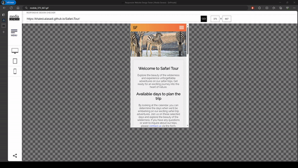
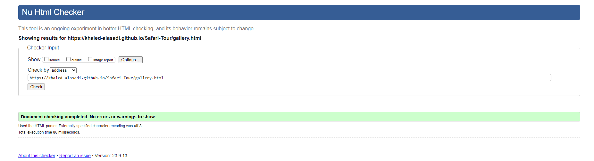
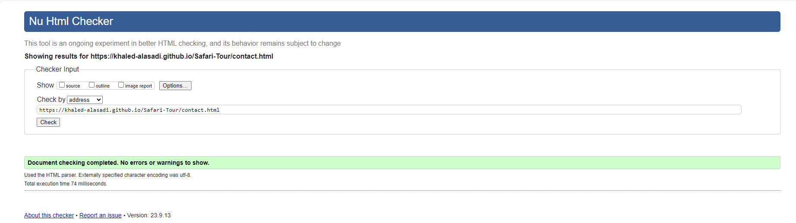

# TESTING

## Compatibility

In order to confirm the correct functionality, responsiveness, and appearance:

- The website was tested on the following browsers: Chrome, Edge, Brave.

  - Edge:

    

  - Chrome:

    

  - Brave:

    

## Responsiveness

- The website was checked by devtools implemented in Edge browser.

  - Main Page:

  

  - Gallery Page:

  

  - Contact Page:

  

  - Response Page:

  

+ The website was checked with [Responsive Website Design Tester](https://responsivedesignchecker.com/).

    - Desktop Screens:

    
    
    
    
    
    
    
    

    - Tablet Screens:

    
    
    
    
    

    - Mobile Screens:
    
    
    
    
    
    
    
    
--- 
## Manual testing

| feature | action | expected result | tested | passed | comments |
| --- | --- | --- | --- | --- | --- |
| Navbar | | | | | |
| Home | Click on the "Home" link | The user is redirected to the main page | Yes | Yes | - |
| Gallery | Click on the "Gallery" link | The user is redirected to the gallery page | Yes | Yes | - |
| Contact | Click on the "Contact" link | The user is redirected to the contact page | Yes | Yes | - |
| Footer | | | | | |
| Instagram icon in the footer | Click on the Instagram icon | The user is redirected to the Instagram page | Yes | Yes | - |
| Facebook icon in the footer | Click on the Facebook icon | The user is redirected to the Facebook page | Yes | Yes | - |
| Github icon in the footer | Click on the Github icon | The user is redirected to the Github page | Yes | Yes | - |
| Home page | | | | | |
| "Contact Us" button in Hero section | Click on the "Contact Us" button | The user is redirected to the contact page | Yes | Yes | - | - |
| Gallery page | | | | | |
| "Contact Us" button in Hero section | Click on the "Contact Us" button | The user is redirected to the contact page | Yes | Yes | - |
| Image in the gallery | Under every image | Animal's name and description appear under the image | Yes | Yes | - |
| Contact page | | | | | |
| First name input | Enter the first name | The first name is entered | Yes | Yes | If user doesn't enter the first name, the error message appears |
| Last name input | Enter the last name | The last name is entered | Yes | Yes | If user doesn't enter the last name, the user gets message to fill out the subject |
| Subject input | Enter the subject | The subject is entered | Yes | Yes | If user doesn't enter the subject, the error message appears |
| Email input | Enter the email | The email is entered | Yes | Yes | If user doesn't enter the email, the error message appears.|
| "Submit" button | Click on the "Submit" button | The user is redirected to the response page | Yes | Yes | - |

---
## Validator testing
+ ### HTML
  #### Home Page
    - No errors or warnings were found when passing through the official W3C validator.

    
    
  #### Gallery Page
    - No errors or warnings were found when passing through the official W3C validator.

    

  #### Contact Page
    - No errors or warnings were found when passing through the official W3C validator.

    

  #### Response Page
    - No errors or warnings were found when passing through the official W3C validator.

    
    
+ ### CSS
  No errors or warnings were found when passing through the official W3C (Jigsaw) validator except:
  
   

## Bugs
+ ### Solved bugs
    - The pictures in the gallery were not centered across all  screens and needed to be fixed.
    - The response page was scrollable even though it was not supposed to be.
    ---
+ ### Unsolved bugs
    - None.
+ ### Mistakes

---